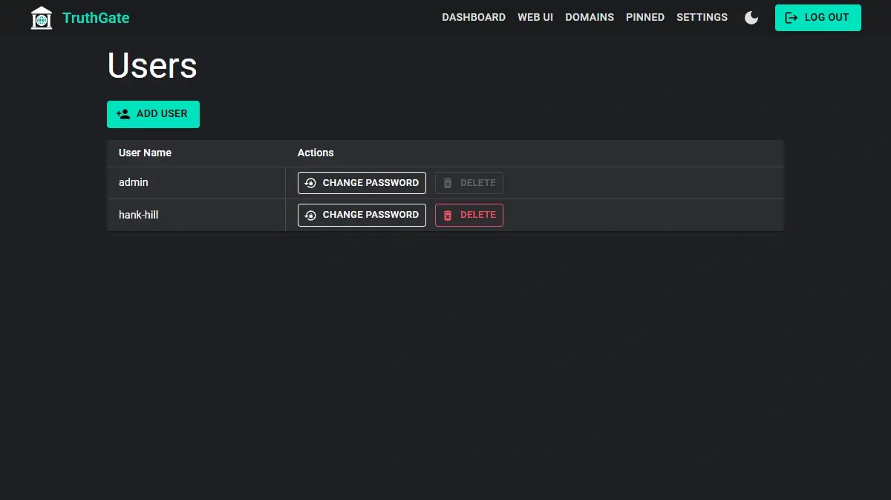
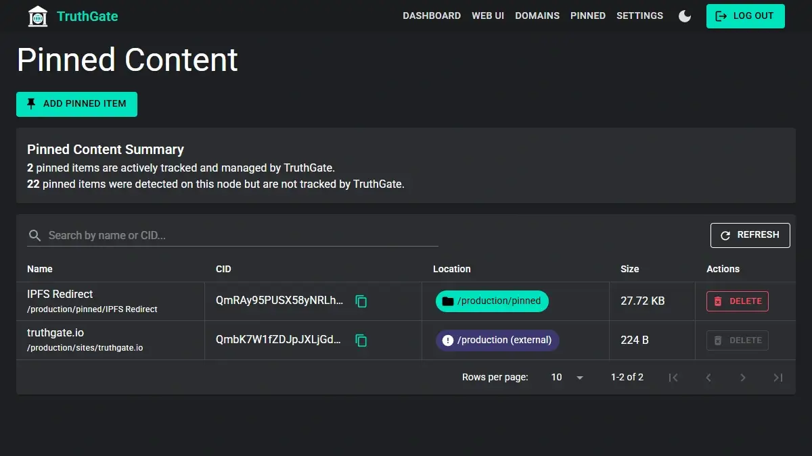
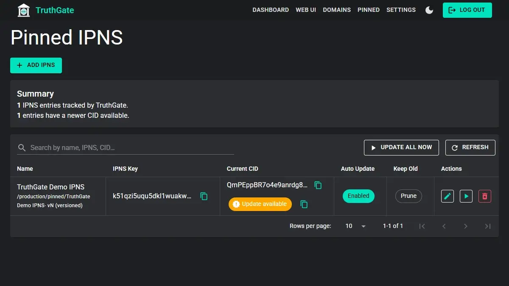
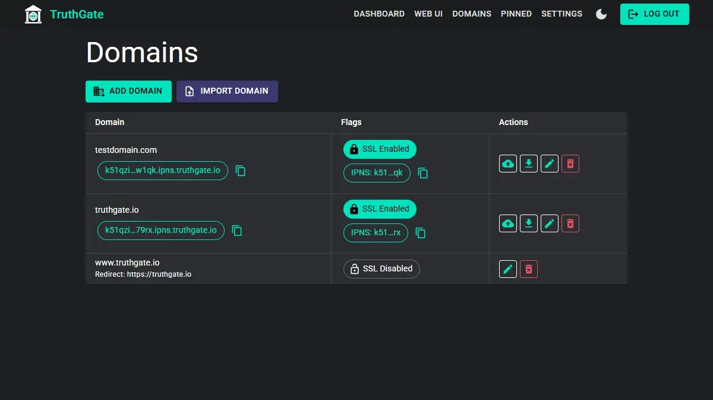
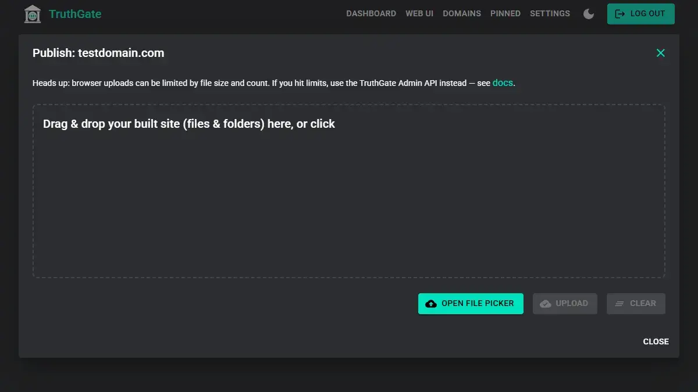
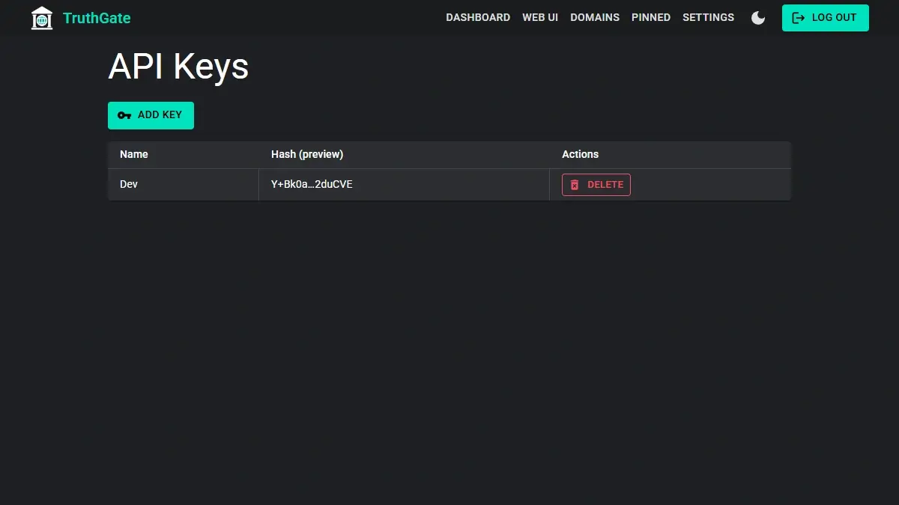
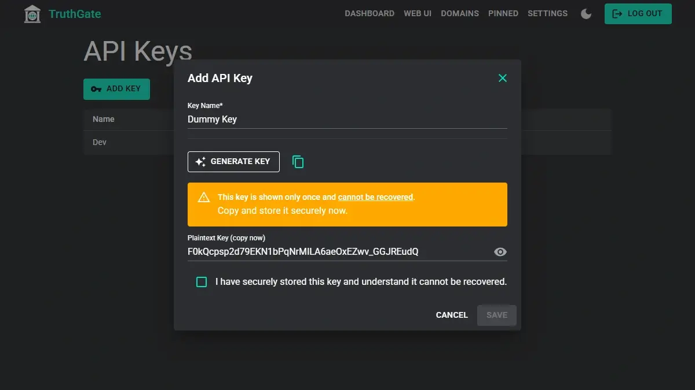

# TruthGate

**TruthGate is a self-hosted edge gateway, control plane, and static-site publishing system for Kubo/IPFS.**

It packages the TruthGate web application, Kubo, and the matching `ipfs` CLI into one Docker appliance, then adds the operational layer that an internet-facing IPFS node usually needs: authenticated accounts, API keys, the native IPFS WebUI behind login, protected gateway and RPC routes, CID and IPNS pinning, domain routing, automatic TLS, static-site publishing, rate limiting, persistent storage, migrations, and diagnostics.

[Read the documentation](docs/index.md) · [Docker Hub](https://hub.docker.com/r/magiccodingman/truthgate-ipfs) · [Report an issue](https://github.com/magiccodingman/TruthGate-IPFS/issues)


## Why TruthGate exists

Kubo is the distributed content system. It addresses content, exchanges blocks, resolves IPNS, participates in the DHT, and exposes powerful local APIs.

Running a useful public service around Kubo still leaves an operator with a different set of problems:

- How do you administer the node without exposing Kubo's unrestricted RPC API to the internet?
- How do multiple people sign in with separate accounts?
- How do applications receive revocable API credentials?
- How do you use the familiar native IPFS WebUI remotely without opening it to everyone?
- How do you publish a static site, bind domains, route SPAs, and obtain certificates?
- How do you follow an IPNS name and keep its current CID pinned automatically?
- How do you update Kubo and TruthGate without losing the repository, identity, keys, database, certificates, or blocks?
- How do you protect public routes from obvious abuse while keeping real users and shared networks usable?

TruthGate sits at that boundary. Kubo remains responsible for IPFS. TruthGate provides the authenticated management plane, publishing workflows, HTTP edge behavior, and operational controls around it.

## What TruthGate does

### Accounts, sessions, and API keys

TruthGate has a login-protected management portal with role-based user accounts. The first boot creates an `admin` account with a unique generated password instead of a shared default credential. Additional users and password changes are managed from the portal.

Applications can use API keys rather than interactive sessions. Keys are shown once when created and stored as hashes. They can be revoked without changing a user's password.



### Native IPFS WebUI behind authentication

TruthGate proxies the native IPFS WebUI through the authenticated portal. Operators keep the interface they already know for browsing files, creating folders, importing content, and managing pins, but the underlying Kubo gateway and RPC API stay bound to loopback inside the appliance.

TruthGate also exposes familiar routes such as `/ipfs/`, `/ipns/`, and the supported `/api/v0/` proxy through its own TLS, authentication, API-key, and rate-protection layers.

### CID and IPNS pinning

Static CID pinning is built in, but watched IPNS pinning is one of TruthGate's most useful features.



An operator can subscribe to an IPNS name and let TruthGate resolve it on a schedule. When the name changes, TruthGate can pin the new target and apply the configured retention behavior to older targets. That turns a mutable IPNS identity into a continuously maintained local copy instead of a manual sequence of resolve-and-pin commands.



### TruthGate Pointer protocol

TruthGate supports the **TruthGate Pointer protocol (TGP)**: a deliberately small convention in which an IPNS identity publishes a tiny `tgp.json` file that points to one current immutable CID.

TGP keeps the mutable layer light, makes freshness checks inexpensive, allows the current target to be cached normally, and supports clear unpin-and-garbage-collection workflows when content is removed. It intentionally does not publish a browsable history through the pointer.

TGP is an operational protocol, not a legal shield. It cannot erase copies retained by third parties, prevent archiving, or make an operator immune from legal obligations. See the [TGP documentation](docs/tgp/index.md) for the specification, rationale, gateway behavior, and legal limitations.

### Static-site publishing

TruthGate publishes static output such as HTML, CSS, JavaScript, WebAssembly, images, and other immutable assets to IPFS. It is suitable for ordinary static sites, SPAs, Blazor WebAssembly applications, and other frameworks whose production output can be served as files.

The publishing flow connects:

1. a build directory or uploaded site;
2. a content-addressed site CID;
3. optional IPNS and TGP metadata;
4. one or more mapped domains;
5. automatic certificate handling and site routing.

[Read the site-publishing guide](docs/site-publishing.md).

### Domains, routing, and automatic TLS

Mapped domains are first-class configuration. TruthGate terminates TLS, obtains and renews ACME certificates, selects certificates by SNI, and routes mapped hosts to their published IPFS content.

An IP address or unmapped management host serves the authenticated TruthGate application. A mapped site host follows the site-serving path instead. This distinction allows the same appliance to provide an operator console and public websites without exposing Kubo directly.





### Public metadata and automation

Published domains can expose small read-only metadata endpoints that report the current site CID and IPNS/TGP state. Monitoring tools, deployment checks, and client applications can use these values without receiving private keys or administrative access.

Authenticated integrations can use API keys for supported Kubo and TruthGate operations.





### One Docker appliance

The production image contains:

- the TruthGate ASP.NET application;
- the pinned Kubo version;
- the matching `ipfs` CLI;
- startup, migration, health, and diagnostic tooling.

The appliance is published for `linux/amd64` and `linux/arm64`. Its root filesystem is read-only in the production Compose definition; writable application state, Kubo repository data, and Kubo blocks use persistent mounts.

### Contributing Kubo defaults

A new repository is initialized as a contributing server rather than a quiet desktop node. Defaults include DHT server routing, inbound TCP/QUIC/WebTransport listeners, hole punching, relay-client support, content providing, automatic storage sizing, and repository garbage collection.

These defaults can be overridden persistently. The Kubo RPC API and HTTP gateway remain loopback-only inside the container.

### Persistence, updates, and migrations

TruthGate separates three persistent host paths:

```text
data/
├── truthgate/       # application config, database, certificates, secrets, state
└── ipfs/
    ├── repo/        # Kubo identity, config, datastore, keystore, repo version
    └── blocks/      # block files
```

Replacing the image does not replace those mounts. Startup checks the existing Kubo repository version and performs supported repository migration before applying managed settings.

### Rate limiting and abuse protection

TruthGate places request protection before expensive proxy and application work. Public endpoints, authenticated administrative paths, and gateway routes have separate policies while sharing ban, whitelist, and IPv6-prefix state.

The documentation describes the current defaults and their limits without pretending that rate limiting is a substitute for network security, monitoring, or capacity planning.

## What TruthGate is not

- TruthGate does not replace IPFS or Kubo.
- TruthGate is not a blockchain or a new content network.
- TruthGate does not make third-party copies of a CID disappear.
- TGP does not provide legal immunity or guaranteed global deletion.
- A mapped HTTPS domain is still an HTTP delivery path; the content remains independently addressable by CID.
- TruthGate is not intended to expose Kubo's unrestricted local RPC interface directly to anonymous internet users.

## Architecture at a glance

```text
Operators, browsers, and API clients
                 │
                 ▼
┌─────────────────────────────────────────────┐
│ TruthGate                                   │
│                                             │
│ Accounts • Sessions • API keys • TLS        │
│ Domains • Publishing • Pinning • TGP        │
│ Rate protection • Metadata • Diagnostics    │
└──────────────────────┬──────────────────────┘
                       │ loopback-only API/gateway
                       ▼
┌─────────────────────────────────────────────┐
│ Kubo                                        │
│                                             │
│ Repository • Blocks • DHT • IPNS • Bitswap  │
└──────────────────────┬──────────────────────┘
                       │
                       ▼
                  IPFS network
```

Read [Architecture](docs/concepts/architecture.md), [Request routing](docs/concepts/request-routing.md), and [Security boundaries](docs/concepts/security-boundaries.md) for the detailed model.

## Quick start

### Requirements

- Docker Engine
- Docker Compose v2.24.4 or newer
- TCP ports `80`, `443`, and `4001`
- UDP port `4001`

Clone the repository and start the tested stable image:

```bash
git clone https://github.com/magiccodingman/TruthGate-IPFS.git
cd TruthGate-IPFS
cp .env.example .env
docker compose pull
docker compose up -d
```

Watch the first startup:

```bash
docker compose logs -f truthgate
```

The log prints:

```text
First-run administrator account: admin
First-run administrator password: <generated value>
```

Open `https://YOUR_SERVER_IP`, accept the temporary self-signed fallback certificate, sign in, and change the password.

The bootstrap password is also retained temporarily at:

```text
data/truthgate/state/bootstrap-admin-password
```

It is removed after the persistent TruthGate configuration exists.

Check the container and Kubo state:

```bash
docker compose ps
docker exec truthgate truthgate-kubo-status
```

Continue with [Docker installation](docs/setup/docker.md) and [First run](docs/setup/first-run.md).

## Updating

```bash
docker compose pull
docker compose up -d
```

The normal Compose configuration follows:

```text
magiccodingman/truthgate-ipfs:stable
```

Pin `TRUTHGATE_IMAGE` to an exact version such as `magiccodingman/truthgate-ipfs:0.1.2` when reproducibility matters more than following the moving stable channel.

See [Updates and image tags](docs/setup/updating.md).

## Development

Development uses the production Compose file first and the development override second:

```bash
docker compose \
  -f compose.yaml \
  -f compose.dev.yaml \
  up --build
```

The two files are merged. `compose.yaml` defines the real appliance contract; `compose.dev.yaml` changes only what development requires, including the build target, source mount, hot reload, HTTP port, writable filesystem, and NuGet caches.

New production behavior belongs in `compose.yaml`, not only in the development override.

See the [Developer documentation](docs/developer/index.md), including [Rider setup](docs/developer/rider.md), Compose conventions, testing guidance, and the intentionally provisional Visual Studio page.

## Documentation

Start at **[docs/index.md](docs/index.md)**.

- [Installation and operations](docs/setup/index.md)
- [Developer guide](docs/developer/index.md)
- [Site publishing](docs/site-publishing.md)
- [Concepts and architecture](docs/concepts/index.md)
- [API documentation](docs/api/index.md)
- [TGP protocol](docs/tgp/index.md)
- [Reference](docs/reference/index.md)
- [Troubleshooting](docs/troubleshooting.md)

## Project status

TruthGate is active open-source infrastructure. Interfaces and behavior may continue to evolve, especially around publishing, APIs, and advanced Kubo orchestration. Exact release tags are available for deployments that should not follow moving channels.

Issues and pull requests are welcome. Documentation changes should describe current behavior, clearly label planned behavior, and avoid security or legal guarantees that the implementation cannot make.

## License and author

TruthGate is maintained by [MagicCodingMan](https://github.com/magiccodingman). See the repository license for usage terms.
