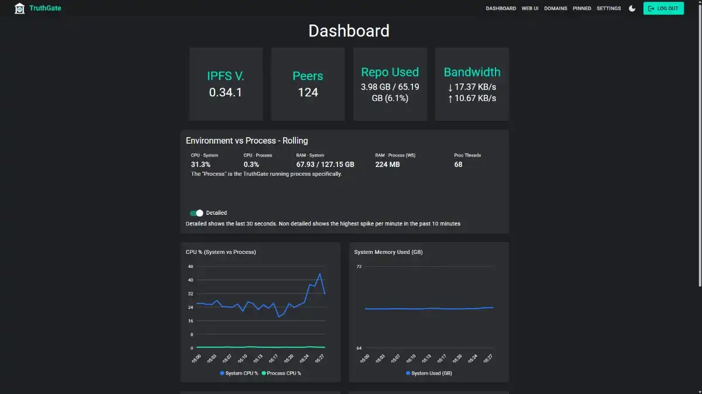

# TruthGate documentation

TruthGate is a self-hosted edge gateway, management plane, and static-site publishing system for Kubo/IPFS.

This documentation is organized by task:

| I want to… | Start here |
|---|---|
| Install a production node | [Setup](setup/index.md) |
| Sign in for the first time | [First run](setup/first-run.md) |
| Publish a static website | [Site publishing](site-publishing.md) |
| Understand the architecture | [Concepts](concepts/index.md) |
| Integrate through APIs | [API documentation](api/index.md) |
| Implement or inspect TGP | [TGP protocol](tgp/index.md) |
| Develop TruthGate | [Developer guide](developer/index.md) |
| Look up exact defaults | [Reference](reference/index.md) |
| Diagnose a problem | [Troubleshooting](troubleshooting.md) |

## Documentation principles

The repository documentation describes behavior that exists in the current codebase.

- Planned behavior is labeled **planned**.
- Security mechanisms are described concretely rather than as guarantees.
- TGP is documented as an operational protocol, not legal immunity.
- Production instructions are Docker-first.
- Every documentation directory has an `index.md`.
- Exact values belong in reference pages so explanatory pages do not duplicate them.

## Core product areas

### Management and access

TruthGate provides account login, role-based users, session authentication, API-key management, and an authenticated path to the native IPFS WebUI.

### IPFS operations

TruthGate manages CID pins, watched IPNS names, current-target repinning, Kubo configuration, storage policy, repository migration, content providing, and node diagnostics.

### Publishing

Static output can be published to IPFS, associated with IPNS/TGP metadata, and served through mapped domains with automatic TLS and SPA-aware routing.

### Protocols and APIs

TruthGate exposes selected authenticated Kubo operations, public domain metadata, and the TruthGate Pointer protocol.

## Recommended reading order

For an operator:

1. [Docker installation](setup/docker.md)
2. [First run](setup/first-run.md)
3. [Networking](setup/networking.md)
4. [Storage and backups](setup/storage-and-backups.md)
5. [Site publishing](site-publishing.md)

For a developer:

1. [Architecture](concepts/architecture.md)
2. [Request routing](concepts/request-routing.md)
3. [Developer guide](developer/index.md)
4. [API index](api/index.md)
5. [TGP specification](tgp/specification-v1.md)
