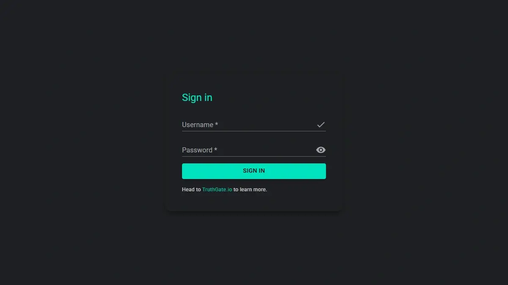

# First run



## Generated administrator credentials

On the first boot, TruthGate creates:

```text
Username: admin
Password: a unique generated value
```

Retrieve it from logs:

```bash
docker compose logs truthgate
```

Look for:

```text
First-run administrator account: admin
First-run administrator password: ...
```

The password is also retained temporarily at:

```text
data/truthgate/state/bootstrap-admin-password
```

That file uses restrictive permissions and is removed after the persistent TruthGate configuration exists.

## Open the portal

For an initial IP-only deployment:

```text
https://YOUR_SERVER_IP
```

The first connection uses a self-signed fallback certificate. Browser warnings are expected until a configured domain receives a trusted certificate.

## Required first actions

1. Sign in as `admin`.
2. Change the administrator password.
3. Create a second administrative account when appropriate.
4. Verify Kubo status.
5. Review storage settings.
6. Confirm external swarm reachability.
7. Back up the persistent paths.

## Native IPFS WebUI

Open the WebUI from the authenticated TruthGate navigation. It is proxied through TruthGate; do not expose Kubo's local WebUI or RPC listener directly.

## Verify Kubo

```bash
docker exec truthgate truthgate-kubo-status
```

From another node:

```bash
ipfs routing findpeer <TRUTHGATE_PEER_ID>
```

## Generated password override

Automated test environments may provide `TRUTHGATE_BOOTSTRAP_ADMIN_PASSWORD` directly to the container. Normal deployments should use the generated password rather than committing a shared credential to `.env`.
